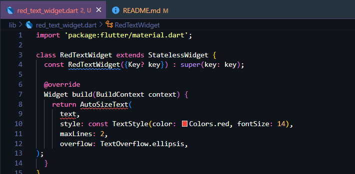
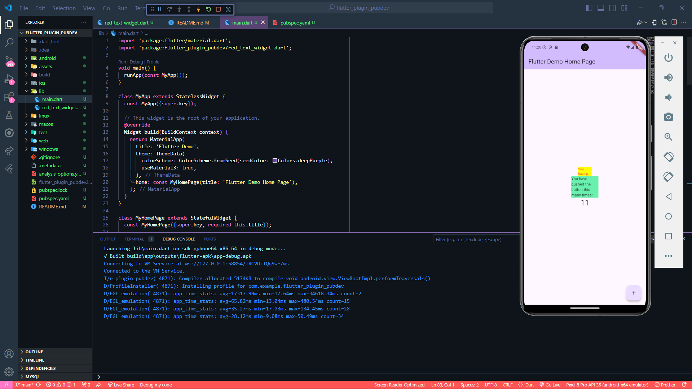

# flutter_plugin_pubdev

A new Flutter project.

**Nama : Afrizal Dwi Septian**  
**NIM : 2241720122**  
**Kelas : TI-3H**

# Praktikum Menerapkan Plugin di Project Flutter

## Langkah 1 : Buat Project Baru

Buatlah sebuah project flutter baru dengan nama flutter_plugin_pubdev. Lalu jadikan repository di GitHub Anda dengan nama flutter_plugin_pubdev.

## Langkah 2 : Menambahkan Plugin

Tambahkan plugin auto_size_text menggunakan perintah berikut di terminal

Jika berhasil, maka akan tampil nama plugin beserta versinya di file pubspec.yaml pada bagian dependencies.

```
flutter pub add auto_size_text
```

## Langkah 3 : Buat file red_text_widget.dart

Buat file baru bernama red_text_widget.dart di dalam folder lib lalu isi kode seperti berikut.

```
import 'package:flutter/material.dart';

class RedTextWidget extends StatelessWidget {
  const RedTextWidget({Key? key}) : super(key: key);

  @override
  Widget build(BuildContext context) {
    return Container();
  }
}
```

## Langkah 4 : Tambah Widget AutoSizeText

Masih di file red_text_widget.dart, untuk menggunakan plugin auto_size_text, ubahlah kode return Container() menjadi seperti berikut.

```
    return AutoSizeText(
      text,
      style: const TextStyle(color: Colors.red, fontSize: 14),
      maxLines: 2,
      overflow: TextOverflow.ellipsis,
);
```

Setelah Anda menambahkan kode di atas, Anda akan mendapatkan info error. Mengapa demikian? Jelaskan dalam laporan praktikum Anda!

Terdapat error dikarenakan tidak adanya import untuk package auto_sized_text di dalam file Dart dan variabel text yang belum dideklarasikan.

Pembetulan code :

```
    import 'package:flutter/material.dart';
    import 'package:auto_size_text/auto_size_text.dart';

    class RedTextWidget extends StatelessWidget {
    final String text;

        const RedTextWidget({Key? key, required this.text}) : super(key: key);

        @override
        Widget build(BuildContext context) {
            return AutoSizeText(
            text,
            style: const TextStyle(color: Colors.red, fontSize: 14),
            maxLines: 2,
            overflow: TextOverflow.ellipsis,
            );
        }
    }
```

## Langkah 5 : Buat Variabel text dan parameter di constructor

Tambahkan variabel text dan parameter di constructor seperti berikut.

```
final String text;

const RedTextWidget({Key? key, required this.text}) : super(key: key);
```

## Langkah 6 : Tambahkan widget di main.dart

Buka file main.dart lalu tambahkan di dalam children: pada class

```
    _MyHomePageState

    Container(
    color: Colors.yellowAccent,
    width: 50,
    child: const RedTextWidget(
                text: 'You have pushed the button this many times:',
            ),
    ),
    Container(
        color: Colors.greenAccent,
        width: 100,
        child: const Text(
            'You have pushed the button this many times:',
            ),
    ),
```

Hasil Praktikum:


# Tugas Praktikum

1.  Selesaikan Praktikum tersebut, lalu dokumentasikan dan push repository Anda berupa screenshot hasil pekerjaan beserta penjelasannya di file README.md!
2.  Jelaskan maksud dari langkah 2 pada praktikum tersebut!  
    Jawab:
    `    flutter pub add auto_size_text 
   `
    Langkah flutter pub add auto_size_text pada praktikum tersebut adalah perintah untuk menambahkan package auto_size_text ke dalam proyek Flutter. Package auto_size_text adalah library yang memungkinkan teks pada aplikasi Flutter untuk secara otomatis menyesuaikan ukuran agar sesuai dengan batas ruang yang disediakan, tanpa memotong teks.

3.  Jelaskan maksud dari langkah 5 pada praktikum tersebut!  
    Jawab:
    ```
    final String text;

        const RedTextWidget({Key? key, required this.text}) : super(key: key);
        ```
        Langkah 5 pada praktikum ini mendefinisikan konstruktor RedTextWidget yang menerima parameter text berupa teks yang wajib diisi saat membuat widget ini. Variabel text diset sebagai final, yang artinya nilainya hanya bisa ditetapkan sekali dan tidak bisa diubah setelahnya. Konstruktor ini juga menggunakan kata kunci const, yang membuat widget ini lebih efisien karena Flutter bisa menggunakan widget yang sama berulang kali tanpa membuat ulang dari awal. Parameter key adalah opsional dan digunakan untuk membantu Flutter mengenali widget ini dalam struktur aplikasi.

4.  Pada langkah 6 terdapat dua widget yang ditambahkan, jelaskan fungsi dan perbedaannya!  
    Jawab:
    ```
    Container(
    color: Colors.yellowAccent,
    width: 50,
    child: const RedTextWidget(
    text: 'You have pushed the button this many times:',
    ),
    ),

        Container(
            color: Colors.greenAccent,
            width: 100,
            child: const Text(
                'You have pushed the button this many times:',
                ),
        ),
        ```
        Pada langkah 6, ada dua Container yang digunakan untuk membungkus widget teks, namun keduanya memiliki fungsi dan perbedaan dalam cara teks ditampilkan.

        1. Container pertama memiliki warna latar belakang kuning (Colors.yellowAccent) dan lebar 50. Di dalam Container ini, terdapat widget kustom RedTextWidget, yang berfungsi untuk menampilkan teks dengan gaya tertentu. Teks yang ditampilkan adalah "You have pushed the button this many times:", dan widget RedTextWidget ini kemungkinan memiliki desain khusus seperti warna teks yang berbeda atau pengaturan tampilan lainnya.

        2. Container kedua memiliki warna latar belakang hijau (Colors.greenAccent) dan lebar 100. Di dalam Container ini, terdapat widget Text standar dari Flutter yang juga menampilkan teks yang sama, yaitu "You have pushed the button this many times:". Widget Text ini tidak memiliki gaya kustom, jadi teks yang ditampilkan hanya menggunakan pengaturan default tanpa modifikasi khusus.

        Perbedaan utama antara kedua Container tersebut adalah pada jenis widget yang digunakan untuk menampilkan teks: yang pertama menggunakan widget kustom RedTextWidget, sedangkan yang kedua menggunakan widget Text standar dari Flutter. Keduanya dibungkus dalam Container dengan warna latar belakang yang berbeda, sehingga menciptakan variasi tampilan yang berbeda meskipun teks yang ditampilkan sama.

5.  Jelaskan maksud dari tiap parameter yang ada di dalam plugin auto_size_text berdasarkan tautan pada dokumentasi berikut https://pub.dev/documentation/auto_size_text/latest/ !  
    Jawab:  
     <table>
    <thead>
    <tr>
    <th>Parameter</th>
    <th>Deskripsi</th>
    </tr>
    </thead>
    <tbody>
    <tr>
    <td><code>key</code></td>
    <td>Mengontrol cara widget menggantikan widget lain dalam pohon widget.</td>
    </tr>
    <tr>
    <td><code>textKey</code></td>
    <td>Menetapkan kunci untuk widget <code>Text</code> yang dihasilkan.</td>
    </tr>
    <tr>
    <td><code>style</code></td>
    <td>Gaya teks yang digunakan (font, warna, dll), jika tidak null.</td>
    </tr>
    <tr>
    <td><code>minFontSize</code></td>
    <td>Ukuran font minimum yang digunakan saat teks menyesuaikan dengan ruang.</td>
    </tr>
    <tr>
    <td><code>maxFontSize</code></td>
    <td>Ukuran font maksimum yang digunakan saat teks menyesuaikan dengan ruang.</td>
    </tr>
    <tr>
    <td><code>stepGranularity</code></td>
    <td>Langkah penyesuaian ukuran font saat menyesuaikan dengan batasan ruang.</td>
    </tr>
    <tr>
    <td><code>presetFontSizes</code></td>
    <td>Daftar ukuran font yang sudah ditentukan, harus diurutkan menurun.</td>
    </tr>
    <tr>
    <td><code>group</code></td>
    <td>Menyinkronkan ukuran teks antara beberapa <code>AutoSizeText</code> dalam satu grup.</td>
    </tr>
    <tr>
    <td><code>textAlign</code></td>
    <td>Penentuan perataan teks secara horizontal (misalnya kiri, tengah, kanan).</td>
    </tr>
    <tr>
    <td><code>textDirection</code></td>
    <td>Arah teks (LTR atau RTL) yang memengaruhi perataan teks seperti <code>TextAlign.start</code> dan <code>TextAlign.end</code>.</td>
    </tr>
    <tr>
    <td><code>locale</code></td>
    <td>Menentukan font berdasarkan lokasi atau karakter Unicode tertentu.</td>
    </tr>
    <tr>
    <td><code>softWrap</code></td>
    <td>Menentukan apakah teks dapat terputus pada batas baris yang lembut.</td>
    </tr>
    <tr>
    <td><code>wrapWords</code></td>
    <td>Menentukan apakah kata yang tidak muat dalam satu baris harus dibungkus. Default: <code>true</code>.</td>
    </tr>
    <tr>
    <td><code>overflow</code></td>
    <td>Menangani teks yang meluber melebihi ruang yang tersedia (misalnya dengan memotong atau ellipsis).</td>
    </tr>
    <tr>
    <td><code>overflowReplacement</code></td>
    <td>Widget pengganti yang ditampilkan jika teks meluber dan tidak muat dalam batas.</td>
    </tr>
    <tr>
    <td><code>textScaleFactor</code></td>
    <td>Faktor skala font berdasarkan pengaturan sistem, memengaruhi ukuran teks.</td>
    </tr>
    <tr>
    <td><code>maxLines</code></td>
    <td>Membatasi jumlah baris teks yang dapat ditampilkan.</td>
    </tr>
    <tr>
    <td><code>semanticsLabel</code></td>
    <td>Label alternatif untuk pembaca layar.</td>
    </tr>
    </tbody>
    </table>

6.  Kumpulkan laporan praktikum Anda berupa link repository GitHub kepada dosen!
